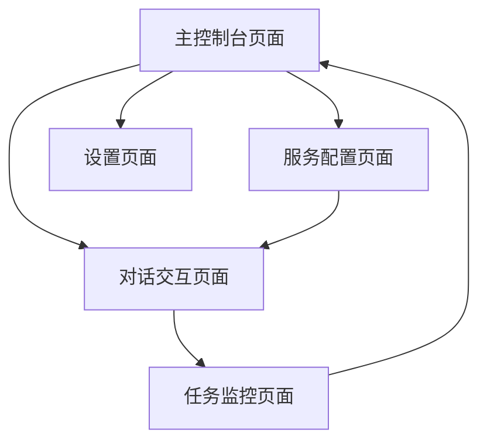

# MCP客户端产品需求文档

## 1. 产品概述
MCP客户端是一个单机版跨平台桌面应用程序，内置本地MCP服务器，提供完整的离线MCP服务体验。
- 集成大语言模型和丰富的内置MCP服务，用户可以使用自然语言指令进行文件管理、数据处理、系统操作等。
- 本地服务器提供文件系统、数据处理、系统工具等多种MCP服务，无需外部依赖即可使用。
- 目标是成为功能完整的单机版MCP工作站，为用户提供隐私安全、响应快速的本地化MCP服务体验。

## 2. 核心功能

### 2.1 用户角色
| 角色 | 使用方式 | 核心权限 |
|------|----------|----------|
| 本地用户 | 直接启动应用程序 | 可使用所有内置MCP服务、配置LLM、查看任务历史、管理本地设置 |
| 高级用户 | 开启开发者模式 | 可添加自定义MCP服务、修改服务配置、查看详细日志、导出数据 |

### 2.2 功能模块
我们的单机版MCP客户端包含以下主要页面：
1. **主控制台页面**：内置服务状态、任务历史记录、系统资源监控
2. **对话交互页面**：自然语言输入、LLM响应显示、实时任务进度展示
3. **服务管理页面**：内置MCP服务配置、服务启用/禁用、能力查看
4. **任务监控页面**：实时任务执行状态、详细日志、性能统计
5. **系统设置页面**：LLM配置、本地服务器设置、应用偏好

### 2.3 页面详情
| 页面名称 | 模块名称 | 功能描述 |
|----------|----------|----------|
| 主控制台页面 | 服务状态面板 | 显示已连接的MCP服务状态、连接数量、服务健康度 |
| 主控制台页面 | 任务历史 | 展示最近执行的任务列表、执行结果、时间戳 |
| 主控制台页面 | 快速操作 | 提供常用MCP服务的快捷入口和预设指令 |
| 对话交互页面 | 聊天界面 | 支持自然语言输入、显示LLM解析结果、展示MCP调用过程 |
| 对话交互页面 | 进度显示器 | 实时显示任务执行进度、步骤详情、完成状态 |
| 对话交互页面 | 结果展示 | 格式化显示MCP服务返回的结果、支持多种数据类型 |
| 服务配置页面 | 连接管理 | 添加、编辑、删除MCP服务器连接、测试连接状态 |
| 服务配置页面 | 认证设置 | 配置API密钥、证书、访问令牌等认证信息 |
| 服务配置页面 | 能力发现 | 自动检测并显示MCP服务支持的工具和资源 |
| 任务监控页面 | 实时监控 | 显示当前正在执行的任务、进度条、状态更新 |
| 任务监控页面 | 执行日志 | 详细记录每个步骤的执行日志、错误信息、调试信息 |
| 任务监控页面 | 性能统计 | 显示任务执行时间、成功率、资源使用情况 |
| 设置页面 | LLM配置 | 选择和配置大语言模型、API密钥、模型参数 |
| 设置页面 | 界面设置 | 主题选择、语言设置、布局偏好 |
| 设置页面 | 系统设置 | 日志级别、缓存设置、自动更新配置 |

## 3. 核心流程

**用户操作流程：**
用户首先在主控制台页面查看系统状态，然后进入服务配置页面添加和配置MCP服务器。配置完成后，用户在对话交互页面输入自然语言指令，系统通过LLM解析指令并调用相应的MCP服务。在任务监控页面，用户可以实时查看任务执行进度和详细日志。最后在设置页面调整系统配置和个人偏好。

## 4. 用户界面设计

### 4.1 设计风格
- **主色调**：深蓝色(#1e3a8a)作为主色，浅蓝色(#3b82f6)作为辅助色
- **按钮样式**：圆角矩形按钮，支持悬停和点击动画效果
- **字体**：系统默认字体，标题使用16-20px，正文使用14px，代码使用等宽字体
- **布局风格**：现代化卡片式布局，左侧导航栏，主内容区域采用网格布局
- **图标风格**：使用简洁的线性图标，支持状态指示器和进度动画

### 4.2 页面设计概览

| 页面名称 | 模块名称 | UI元素 |
|----------|----------|--------|
| 主控制台页面 | 服务状态面板 | 状态卡片、连接指示灯、健康度仪表盘、深蓝色背景 |
| 主控制台页面 | 任务历史 | 时间线组件、状态标签、搜索过滤器、分页控件 |
| 对话交互页面 | 聊天界面 | 消息气泡、输入框、发送按钮、滚动区域、代码高亮 |
| 对话交互页面 | 进度显示器 | 进度条、步骤指示器、动画效果、状态图标 |
| 服务配置页面 | 连接管理 | 表单组件、连接测试按钮、状态指示器、配置向导 |
| 任务监控页面 | 实时监控 | 实时图表、状态面板、刷新控件、过滤选项 |
| 设置页面 | LLM配置 | 下拉选择器、输入框、测试按钮、配置验证提示 |

### 4.3 响应式设计
产品采用桌面优先的设计策略，同时支持网页端的响应式适配。桌面版本提供完整功能体验，网页版本针对触摸交互进行优化，支持移动设备访问。界面布局会根据屏幕尺寸自动调整，确保在不同设备上都有良好的用户体验。