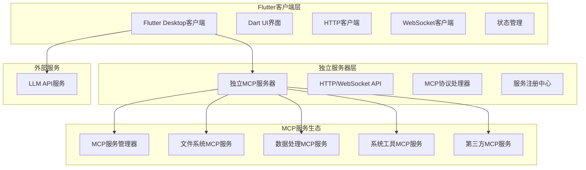
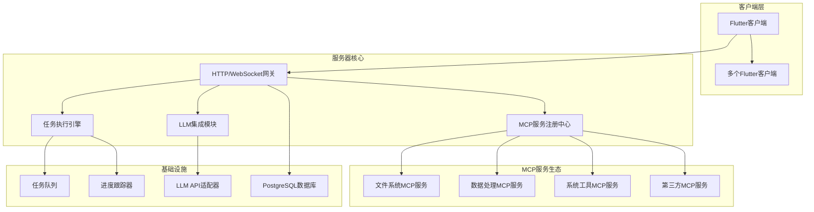
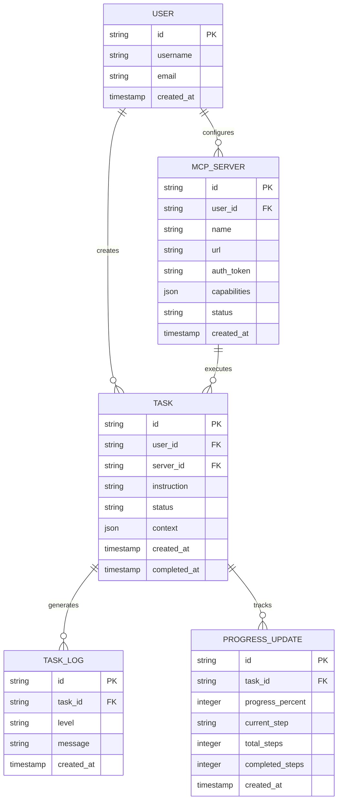

# MCP客户端技术架构文档

## 1. 架构设计



## 2. 技术描述

**客户端-服务器分离技术栈：**
- 桌面客户端：Flutter Desktop + Dart + Material Design
- 独立服务器：Node.js + Express@4 + WebSocket + TypeScript
- MCP协议：标准MCP协议实现 + 服务注册机制
- MCP服务：可插拔的MCP服务模块，支持动态加载
- 状态管理：Provider + Riverpod (Flutter生态)
- 构建工具：Flutter Build + Docker (服务器容器化)
- 数据存储：PostgreSQL/SQLite (服务器端数据库)

**客户端-服务器架构优势：**
- 客户端专注于UI体验，服务器专注于MCP服务管理
- 支持多客户端连接，可以同时为多个用户提供服务
- 服务器可以部署在本地或远程，灵活的部署选择
- MCP服务可以独立开发、测试和部署，模块化程度高
- Flutter提供一致的跨平台UI体验，未来可扩展到移动端

## 3. 路由定义

| 路由 | 用途 |
|------|------|
| / | 主控制台页面，显示系统状态和服务概览 |
| /chat | 对话交互页面，用户输入指令和查看LLM响应 |
| /services | 服务配置页面，管理MCP服务器连接 |
| /monitor | 任务监控页面，实时查看任务执行状态 |
| /settings | 设置页面，配置LLM和系统参数 |

## 4. API定义

### 4.1 MCP服务器API

**获取可用MCP服务列表**
```
GET /api/mcp/services
```

响应参数：
| 参数名称 | 参数类型 | 描述 |
|----------|----------|------|
| services | array | 已注册的MCP服务列表 |
| service.id | string | 服务唯一标识 |
| service.name | string | 服务名称 |
| service.description | string | 服务描述 |
| service.version | string | 服务版本 |
| service.status | string | 服务状态 (active/inactive/error) |
| service.capabilities | array | 服务支持的工具和资源列表 |

示例响应：
```json
{
  "services": [
    {
      "id": "filesystem-mcp",
      "name": "文件系统MCP服务",
      "description": "提供文件查找、复制、移动、删除等功能",
      "version": "1.0.0",
      "status": "active",
      "capabilities": {
        "tools": ["find_files", "copy_file", "move_file", "delete_file"],
        "resources": ["file_tree", "file_content"]
      }
    },
    {
      "id": "data-processor-mcp",
      "name": "数据处理MCP服务",
      "description": "提供数据转换、格式化、分析等功能",
      "version": "2.1.0",
      "status": "active",
      "capabilities": {
        "tools": ["convert_format", "analyze_data", "generate_report"],
        "resources": ["data_schema", "analysis_templates"]
      }
    }
  ]
}
```

**任务执行相关**
```
POST /api/tasks/execute
```

请求参数：
| 参数名称 | 参数类型 | 是否必需 | 描述 |
|----------|----------|----------|------|
| instruction | string | true | 用户自然语言指令 |
| serverId | string | true | 目标MCP服务器ID |
| context | object | false | 上下文信息 |

响应参数：
| 参数名称 | 参数类型 | 描述 |
|----------|----------|------|
| taskId | string | 任务唯一标识 |
| status | string | 任务状态 |
| estimatedTime | number | 预估执行时间(秒) |

**实时进度更新**
```
WebSocket: /ws/tasks/{taskId}/progress
```

消息格式：
```json
{
  "taskId": "task_123",
  "progress": 65,
  "currentStep": "正在搜索.jpg文件",
  "totalSteps": 3,
  "completedSteps": 2,
  "logs": ["开始扫描目录", "找到15个.jpg文件"]
}
```

## 5. 独立MCP服务器架构图



## 6. 数据模型

### 6.1 数据模型定义



### 6.2 数据定义语言 (PostgreSQL)

**客户端连接表 (client_connections)**
```sql
-- 创建客户端连接表
CREATE TABLE client_connections (
    id UUID PRIMARY KEY DEFAULT gen_random_uuid(),
    client_id VARCHAR(100) UNIQUE NOT NULL,
    client_name VARCHAR(200),
    client_version VARCHAR(50),
    platform VARCHAR(50),
    last_seen TIMESTAMP WITH TIME ZONE DEFAULT NOW(),
    status VARCHAR(20) DEFAULT 'connected' CHECK (status IN ('connected', 'disconnected')),
    created_at TIMESTAMP WITH TIME ZONE DEFAULT NOW()
);

-- 创建索引
CREATE INDEX idx_client_connections_client_id ON client_connections(client_id);
CREATE INDEX idx_client_connections_status ON client_connections(status);
```

**MCP服务注册表 (mcp_service_registry)**
```sql
-- 创建MCP服务注册表
CREATE TABLE mcp_service_registry (
    id UUID PRIMARY KEY DEFAULT gen_random_uuid(),
    service_id VARCHAR(100) UNIQUE NOT NULL,
    name VARCHAR(200) NOT NULL,
    description TEXT,
    version VARCHAR(50) NOT NULL,
    capabilities JSONB DEFAULT '{}', -- 存储工具和资源能力
    config JSONB DEFAULT '{}', -- 服务配置
    status VARCHAR(20) DEFAULT 'inactive' CHECK (status IN ('active', 'inactive', 'error')),
    health_check_url VARCHAR(500),
    last_health_check TIMESTAMP WITH TIME ZONE,
    created_at TIMESTAMP WITH TIME ZONE DEFAULT NOW(),
    updated_at TIMESTAMP WITH TIME ZONE DEFAULT NOW()
);

-- 创建索引
CREATE INDEX idx_mcp_service_registry_service_id ON mcp_service_registry(service_id);
CREATE INDEX idx_mcp_service_registry_status ON mcp_service_registry(status);
CREATE INDEX idx_mcp_service_registry_capabilities ON mcp_service_registry USING GIN (capabilities);
```

**任务历史表 (task_history)**
```sql
-- 创建任务历史表
CREATE TABLE task_history (
    id INTEGER PRIMARY KEY AUTOINCREMENT,
    task_id VARCHAR(50) UNIQUE NOT NULL,
    service_id VARCHAR(50) NOT NULL,
    instruction TEXT NOT NULL,
    status VARCHAR(20) DEFAULT 'pending' CHECK (status IN ('pending', 'running', 'completed', 'failed')),
    context TEXT, -- JSON格式
    result TEXT, -- JSON格式
    progress INTEGER DEFAULT 0,
    error_message TEXT,
    created_at DATETIME DEFAULT CURRENT_TIMESTAMP,
    completed_at DATETIME
);

-- 创建索引
CREATE INDEX idx_task_history_task_id ON task_history(task_id);
CREATE INDEX idx_task_history_status ON task_history(status);
CREATE INDEX idx_task_history_created_at ON task_history(created_at DESC);
```

**任务日志表 (task_logs)**
```sql
-- 创建任务日志表
CREATE TABLE task_logs (
    id INTEGER PRIMARY KEY AUTOINCREMENT,
    task_id VARCHAR(50) NOT NULL,
    level VARCHAR(10) NOT NULL CHECK (level IN ('info', 'warn', 'error', 'debug')),
    message TEXT NOT NULL,
    timestamp DATETIME DEFAULT CURRENT_TIMESTAMP
);

-- 创建索引
CREATE INDEX idx_task_logs_task_id ON task_logs(task_id);
CREATE INDEX idx_task_logs_timestamp ON task_logs(timestamp DESC);

-- 初始化MCP服务注册数据
INSERT INTO mcp_service_registry (service_id, name, description, version, capabilities, status) VALUES 
('filesystem-mcp', '文件系统MCP服务', '提供文件查找、复制、移动、删除等功能', '1.0.0', 
 '{
   "tools": ["find_files", "copy_file", "move_file", "delete_file", "read_file", "write_file"],
   "resources": ["file_tree", "file_content"]
 }', 'active'),
('data-processor-mcp', '数据处理MCP服务', '提供数据转换、格式化、分析等功能', '2.1.0',
 '{
   "tools": ["convert_format", "analyze_data", "generate_report", "extract_data"],
   "resources": ["data_schema", "analysis_templates"]
 }', 'active'),
('system-tools-mcp', '系统工具MCP服务', '提供系统信息查询、进程管理等功能', '1.2.0',
 '{
   "tools": ["get_system_info", "list_processes", "run_command", "get_env_vars"],
   "resources": ["system_status", "process_list"]
 }', 'active');

-- 初始化示例客户端连接
INSERT INTO client_connections (client_id, client_name, client_version, platform, status) VALUES 
('flutter-desktop-001', 'MCP客户端 - 开发环境', '1.0.0', 'macos', 'connected'),
('flutter-desktop-002', 'MCP客户端 - 测试环境', '1.0.0', 'windows', 'disconnected');
```